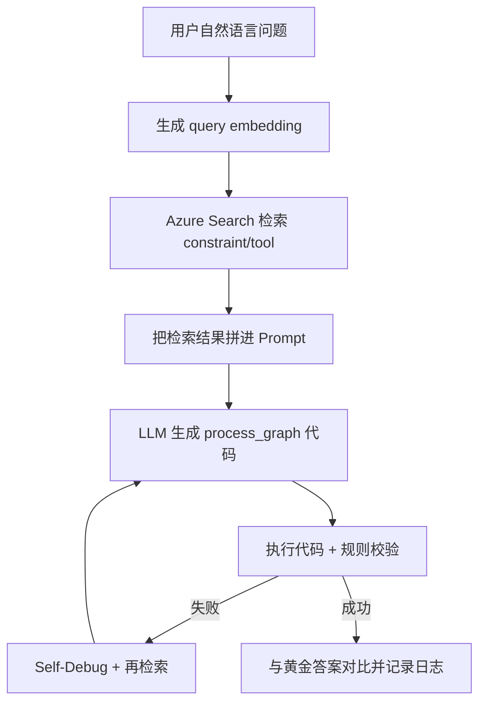

# MeshAgent RAG 零基础教程（含项目实战）

Date: 2026-03-07  
Author: Codex  
Audience: 没学过 AI / 只懂编程与系统的 CS 同学

---

## 文档定位（RAG 概念与项目内落点）
本篇重点是解释 RAG 在 MeshAgent 里的工作机制与排障思路。  
Azure 资源创建、deployment 命名、账号限制与配额策略不在本篇展开，统一看：

1. `docs/Azure 注册后完整操作手册（先跑通版）-2026-03-08.md`
2. `docs/文档导航与阅读顺序-2026-03-08.md`

---

## 1. 先用一句话理解 RAG

RAG（Retrieval-Augmented Generation）= **先查资料，再让模型回答/写代码**。  
它的目标是降低“模型凭空编”的概率，让输出更贴近你项目里的真实规则和工具说明。

---

## 2. 你最少要懂的 RAG 概念（够用版）

1. 检索库（Knowledge Base）
- 你准备的知识文档集合。
- 在本项目里就是 `data/rag_constraints.json` 和 `data/rag_tools.json`。

2. 向量（Embedding）
- 把一段文本变成一串数字，用来算“语义相似度”。
- 文本越相近，向量距离越近。

3. 向量检索（Vector Search）
- 把用户问题也变向量，然后找最相似的 top-k 文档片段。

4. 增强生成（Augmented Generation）
- 把检索到的约束/工具文本拼进 Prompt，再让 LLM 生成代码。

5. 为什么比“直接问模型”好
- 模型不知道你项目私有规则；RAG 可以把规则喂进去。
- 对这种“图操作 + 约束校验”的任务，RAG 很关键。

---

## 3. RAG 在 MeshAgent 里具体怎么用

## 3.1 知识从哪里来

每个子项目都有两类 RAG 数据：
- `data/rag_constraints.json`：约束规则（该怎么做/不能怎么做）
- `data/rag_tools.json`：工具描述（该用什么图算法/操作）

---

## 3.2 索引怎么建（离线文件 -> Azure Search）

通过 `create_RAG_index` 下 notebook：
- `rag_azure_constraint.ipynb`
- `rag_azure_tools.ipynb`

典型流程是：
1. 读取 `rag_*.json`
2. 生成 embedding（CRG/MALT 多用 `text-embedding-ada-002`）
3. 写入 `output/*Vectors.json`
4. 创建 Azure Search 索引
5. `upload_documents` 上传文档

仓库中可见的默认索引名：
- CRG: `app-crg-rag-constraint`, `app-crg-rag-tool`
- MALT: `app-malt-rag-constraint`, `app-malt-rag-tool`
- traffic-analysis notebook 默认：`test-rag-traffic-analysis`, `sigcomm-tool-traffic`

---

## 3.3 运行时检索怎么触发

在主实验脚本 `full_cot_with_tools.py` 里：

1. 读取环境变量
- `AZURE_SEARCH_SERVICE_ENDPOINT`
- `AZURE_SEARCH_ADMIN_KEY`
- `RAG_MALT_CONSTRAINT`
- `RAG_MALT_TOOL`

2. 针对用户 query 做两次检索
- `rag_constraint_search(query)`：拿约束
- `rag_tool_search(query)`：拿工具

3. 检索结果会进入代码生成链
- `summary_gen_chain`：先分解 3 步
- `cot_plus_tool_chain`：逐步生成 `process_graph(...)`
- `pySelfDebugger`：执行失败时自纠错

4. 执行和评估
- 执行生成代码
- 规则校验（`error_check.py`）
- 与黄金答案对比
- 写入 `logs/*.jsonl`

---

## 3.4 三个子项目的 RAG 差异（很重要）

1. `app-CRG` / `app-malt`
- 主流程使用向量检索：`vector=Vector(... fields=\"constraintVector\"/\"descriptionVector\")`
- 是比较标准的 RAG 路径。

2. `app-traffic-analysis`
- 代码里向量检索行被注释，当前更像关键词检索：
  - 约束检索 `search_text=''`（近似全取/弱过滤）
  - 工具检索 `search_text=query`
- 所以它和另外两套在“检索质量”上不完全同构。

3. 工具检索阈值
- `extract_tools` 里有 `@search.score` 阈值：
  - CRG/traffic: `< 0.80` 返回 `"no tools available"`
  - MALT: `< 0.85` 返回 `"no tools available"`

---

## 4. 你可以把 RAG 想成这条流水线



---

## 5. 零基础上手步骤（项目内实操）

## Step 0: 环境准备（conda）

```powershell
conda create -n meshagent python=3.11 pip -y
conda activate meshagent
python -m pip install -U pip
```

建议先装离线依赖：

```powershell
pip install pandas networkx numpy jsonlines python-dotenv prototxt-parser scikit-learn tenacity
```

要跑在线 RAG 主实验再装：

```powershell
pip install "openai<1.0.0" "langchain==0.0.350" azure-search-documents azure-core azure-identity
```

---

## Step 1: 准备 `.env`

可参考 `app-traffic-analysis/env_example`。核心变量：

```env
OPENAI_API_TYPE=...
OPENAI_API_VERSION=...
OPENAI_API_KEY=...
OPENAI_API_BASE=...

AZURE_SEARCH_ADMIN_KEY=...
AZURE_SEARCH_SERVICE_ENDPOINT=...

RAG_MALT_CONSTRAINT=...
RAG_MALT_TOOL=...
```

---

## Step 2: 建 RAG 索引

按子项目进入 `create_RAG_index`，跑两个 notebook：
1. `rag_azure_constraint.ipynb`
2. `rag_azure_tools.ipynb`

目标是让 Azure Search 里真的有这两个索引和文档。

---

## Step 3: 跑主流程（以 CRG 为例）

```powershell
cd app-CRG
python full_cot_with_tools.py
```

你应该在输出里看到类似：
- `Constraints: ...`
- `Tools: ...`
- `Step 1/2/3 ...`

最后会写日志到 `logs/...jsonl`。

---

## Step 4: 判断 RAG 是否“真的工作了”

最直接看三点：
1. `Constraints:` 不是空字符串
2. `Tools:` 不是长期 `"no tools available"`
3. 同一条 query 改写后，检索出的约束文本会变化

如果三点都不满足，通常是索引没建好或 `.env` 对不上。

---

## 6. 常见报错与定位

1. `ModuleNotFoundError: dotenv`
- 没装 `python-dotenv` 或没激活正确环境。

2. `Resource not found` / 404
- `OPENAI_API_BASE`、deployment 名、或 Azure Search endpoint 不匹配。

3. 检索总是空/无关
- `RAG_MALT_CONSTRAINT` / `RAG_MALT_TOOL` 索引名填错。
- notebook 没执行到 `upload_documents`。

4. 能跑但效果差
- `rag_constraints.json` / `rag_tools.json` 质量不足。
- top-k 过大或过小。
- 工具阈值过严导致常回 `"no tools available"`。

---

## 7. 你现在真正要掌握到什么程度

如果你能解释下面 5 句话，就已经够用了：
1. RAG 是“先检索，再生成”。
2. 这个项目检索的是 constraints 和 tools 两类知识。
3. 知识先从 `rag_*.json` 建成 Azure Search 索引。
4. `full_cot_with_tools.py` 每条 query 都会先检索再生成代码。
5. 检索失败时，自纠错和结果质量都会明显变差。

---

## 8. 给你的学习建议（CS 背景友好）

先别追大模型理论，按工程顺序学最有效：
1. 看懂 `full_cot_with_tools.py` 中 `rag_constraint_search` / `rag_tool_search`
2. 看懂 `helper.py` 的 `extract_constraints` / `extract_tools`
3. 再看 `ai_models_cot.py` 里 Prompt 模板如何消费检索结果
4. 最后再去看 embedding 与向量库细节

这样你会把 RAG 当成一个“检索中间件 + Prompt 注入层”，而不是黑箱。
