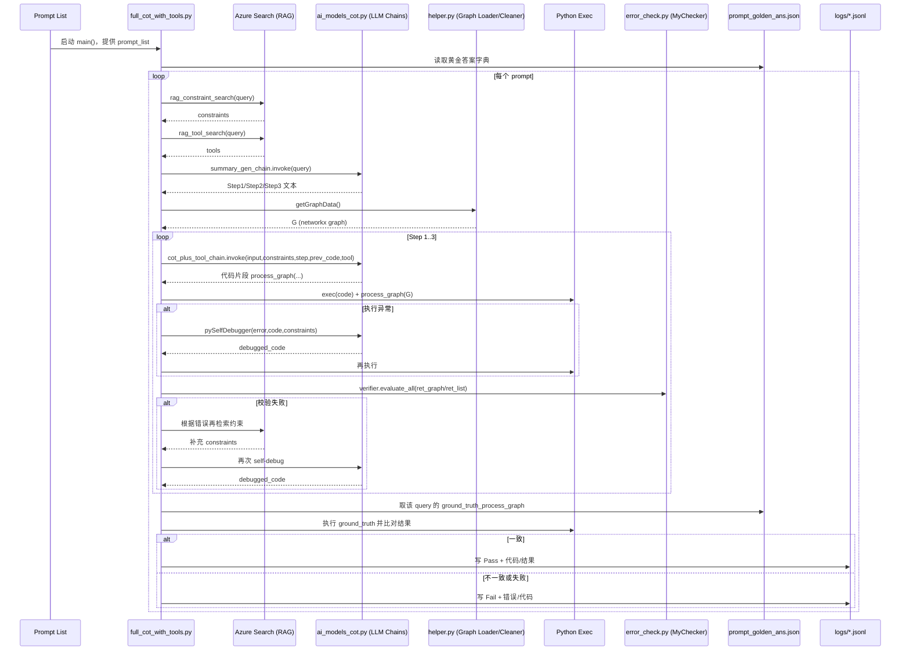

# MeshAgent 文件作用与数据通路说明

Date: 2026-03-06  
Author: Codex

## 文档定位（代码结构说明）
本篇用于回答“哪些文件负责什么、数据怎么流动”。  
它不替代部署手册，不覆盖 Azure 门户逐步操作。

推荐搭配阅读：
1. `docs/文档导航与阅读顺序-2026-03-08.md`
2. `docs/Azure 注册后完整操作手册（先跑通版）-2026-03-08.md`
3. `docs/教程-rag-primer-and-tutorial-2026-03-07.md`

## 1. 你当前打开文件的大致作用

1. `app-CRG/golden_answer_generator/crg_query.py`
- 定义 `prompts` 和对应 `answers`（答案是 `ground_truth_process_graph` 代码字符串）。
- 将其转成 `prompt -> answer_code` 的字典并写入 `prompt_golden_ans.json`。

2. `app-CRG/golden_answer_generator/fine_tune_data_prepare.py`
- 将同一批 `prompts/answers` 组织成聊天训练格式 `messages`。
- 输出 `crg-finetune.jsonl`。

3. `app-CRG/golden_answer_generator/crg-finetune.jsonl`
- 离线生成的数据集产物，每行一条训练样本（jsonl）。

4. `app-CRG/golden_answer_generator/prompt_golden_ans.json`
- CRG 场景黄金答案库。
- 主实验脚本会按 query 去这里取“标准答案代码”。

5. `app-CRG/full_cot_with_tools.py`
- 主实验引擎：检索 RAG、调用模型生成代码、执行与自纠错、与黄金答案比对、写日志。

6. `app-CRG/ai_models_cot.py`
- 封装模型与提示链（summary、分步代码生成、self-debug）。

## 2. 项目核心文件分层（按职责）

1. 数据源加载层：`helper.py`
- `app-CRG/helper.py`：从 `data/resources.json` 读图。
- `app-malt/helper.py`：从 `data/malt-example-final.textproto.txt` 解析图。
- `app-traffic-analysis/helper.py`：从 `data/test_graph.json` 读图。

2. 规则校验层：`error_check.py`
- 对图结构与结果约束做校验，提供自纠错反馈。

3. 模型编排层：`ai_models_cot.py`
- 定义 LLM chain 与模板（步骤摘要、代码生成、debug）。

4. 实验执行层：`full_cot_with_tools.py`（及 `app-malt` 的 baseline/cot 变体）
- 执行“检索 -> 生成 -> 执行 -> 纠错 -> 评估 -> 记录”。

5. 黄金答案构建层：`golden_answer_generator/*.py`
- `*_query.py` / `write_new_pair_to_df.py` 生成 `prompt_golden_ans.json`。
- `fine_tune_data_prepare.py` 生成 `*-finetune.jsonl`。

6. RAG 素材层：`data/rag_constraints.json`、`data/rag_tools.json`。

7. RAG 索引构建层：`create_RAG_index/*.ipynb` + `create_RAG_index/output/*Vectors.json`。

8. 配置层：`.env`（样例见 `app-traffic-analysis/env_example`）。

## 3. 数据通路（宏观）

### 3.1 离线路径（不依赖云）

`golden_answer_generator/*.py` 中的 prompts/answers  
-> 生成 `prompt_golden_ans.json`  
-> 生成 `*-finetune.jsonl`  
-> 完成“数据准备链路跑通”的离线验证。

### 3.2 在线实验路径（依赖 Azure/OpenAI）

`data/rag_*.json` + notebook 构建 Azure Search 索引  
-> `full_cot_with_tools.py` 检索约束/工具  
-> `ai_models_cot.py` 生成 `process_graph` 代码  
-> 在 `helper.py` 加载的图上执行  
-> `error_check.py` 校验并触发自纠错  
-> 读取 `prompt_golden_ans.json` 对照  
-> 写 `logs/*.jsonl` 结果。

## 4. app-CRG 逐步时序图（详细）

## 5. 一句话总结

MeshAgent 的核心是：把自然语言问题转成图操作代码，配合 RAG 约束检索和自纠错执行，再与黄金答案自动对比评估。
